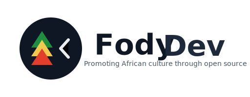
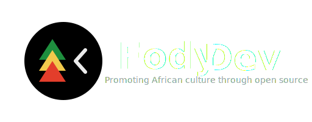
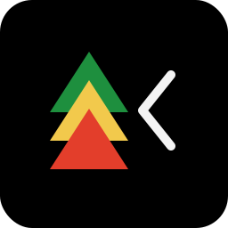

# FodyDev Brand

### Full wordmark + emblem (horizontal)

- Normal

- On blue background

---

### Compact emblem-only (square / favicon)

- Normal

- On blue background

---

### Why this design

* **Pan-African colors** (green / gold / red) signal the cultural focus without referencing any single sacred motif.
* **Stacked chevrons** evoke growth, language/lines of text, and a stylized leaf/feather — organic + digital.
* **Open bracket** (subtle) references *open source* and developer culture.
* Clean, geometric shapes so the logo scales crisply to favicon and print.

---

### Usage notes & color tokens

* Primary colors:

  * Green: `#1E8F3E`
  * Gold:  `#F2C94C`
  * Red:   `#E33E2B`
  * Dark (bg / text): `#0F1724`
  * Accent text: `#1E293B` (for "Dev")
* Spacing: keep clearspace equal to the emblem radius (in the full mark) around the logo.
* Provide a monochrome (single-color) variant in `#0F1724` or white for dark backgrounds if needed.

### Notice

This graphics represents FodyDev. Do not use in a way that implies endorsement without permission.
